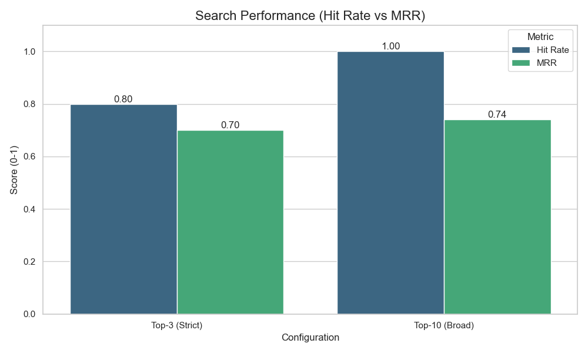
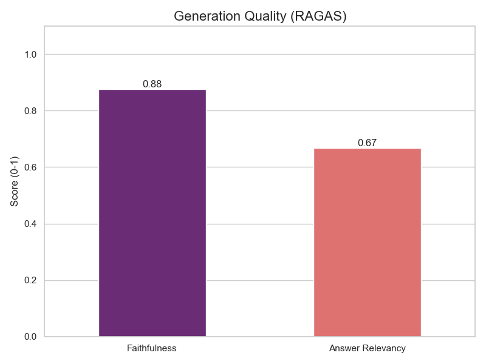

#  RAG Multimodal (BOE Edition)

Este proyecto es un **Sistema de RAG (Retrieval-Augmented Generation) Multimodal Avanzado** diseñado para consultar documentos legales oficiales (como el BOE), entender tablas complejas, analizar imágenes y responder preguntas sobre datos de recursos humanos.

## 🚀 Características Principales

### 1. 📄 Ingesta de Documentos Inteligente
*   **Semantic Chunking**: Utiliza embeddings para detectar cambios de tema y cortar el texto de forma lógica, no por caracteres arbitrarios.
*   **Layout Aware (PyMuPDF4LLM)**: Convierte PDFs a Markdown limpio, conservando **Tablas** y estructura visual antes de procesar.
*   **Categorización por Carpetas**: Detecta la estructura de directorios en `docs/` (ej: `Legal/Nóminas`) e inyecta esa categoría en el contexto semántico.
*   **Ingesta Incremental**: Detecta si un archivo ya existe en la base de datos para evitar re-procesarlo (ahorro de tiempo y costes).

### 2. 👁️ Capacidades Multimodales (Vision)
*   **Análisis Visual de Documentos**: Si el documento contiene imágenes o gráficos, el sistema las busca mediante descripción semántica.
*   **Visual Filter (LLaVA)**: Un nodo agente utiliza el modelo de visión `llava` para "mirar" la imagen candidata y verificar si contiene la respuesta exacta (ej: leer un dato numérico de una tabla escaneada).
*   **Base de Conocimiento Visual**: El sistema utiliza un repositorio de imágenes pre-procesadas y etiquetadas (en `static/labeled_images`) que se recuperan y adjuntan automáticamente a la respuesta cuando son relevantes para la consulta del usuario.
*   **Query-by-Image**: Puedes subir una foto (nómina, contrato) al chat y preguntar sobre ella. El sistema la analiza con LLaVA y usa esa información para buscar en la base de datos.

### 3. 🧠 Router & Agentes ("Cerebro")
El sistema no busca ciegamente. Tiene un **Router Inteligente** que clasifica tu pregunta:
*   **Ruta "RAG"**: Si preguntas sobre leyes o documentos ("¿Qué dice el artículo 5?"), busca en los PDFs.
*   **Ruta "DATA"**: Si preguntas sobre empleados ("¿Cuántas vacaciones le quedan a Adrian?"), consulta una **base de datos estructurada** (`employees.csv`) usando Pandas.

### 4. 🔍 Técnicas de Recuperación Avanzadas
El sistema implementa 4 técnicas sofisticadas para asegurar que siempre se encuentra el documento más relevante:
*   **Recuperación Híbrida (BM25 + Vector)**: Combina la búsqueda semántica (vectores) con la búsqueda por palabras clave (BM25) para capturar tanto el sentido conceptual como términos exactos (ej. número de artículo).
*   **Cross-Encoder Re-ranking**: Un modelo dedicado (`BAAI/bge-reranker`) re-examina los mejores candidatos de la búsqueda inicial y los reordena meticulosamente por relevancia.
*   **Reciprocal Rank Fusion (RRF)**: Algoritmo que fusiona los resultados de BM25 y Vectores de forma justa y ponderada.
*   **Routing Semántico**: Clasificadores automáticos dirigen la pregunta al subsistema experto adecuado (Data vs Documentos).
---

## 🛠️ Requisitos e Instalación

### 1. Entorno Python
```bash
# Crear entorno (recomendado)
conda create -n Tartanga python=3.11
conda activate Tartanga

# Instalar dependencias
pip install -r requirements.txt
```

### 2. Modelos Locales (Ollama)
Necesitas tener [Ollama](https://ollama.com/) instalado y descargados los siguientes modelos:
```bash
ollama pull llama3       # Cerebro de texto
ollama pull llava        # Visión multimodal
```

### 3. Base de datos
No necesitas instalar nada extra. El proyecto usa **ChromaDB** en modo local (carpeta `chroma_db`).

---

## ▶️ Uso del Sistema

### 1. Ingesta de Datos (Preparación)
Antes de chatear, el sistema necesita aprender. Coloca tus PDFs en la carpeta `docs/` (puedes crear subcarpetas).

```bash
# Ejecutar ingesta inteligente
python ingest_multimodal.py
```
*Este proceso leerá tus PDFs, extraerá tablas y texto, creará chunks semánticos y los guardará en ChromaDB.*

### 2. Iniciar el Backend (Cerebro)
En una terminal:
```bash
uvicorn main:app --host 0.0.0.0 --port 8000 --reload
```
*Si aparece "🧠 RAG Table-Master Iniciado", significa que el backend se ha iniciado correctamente.*

### 3. Iniciar el Frontend (Chat)
En **otra** terminal:
```bash
streamlit run frontend.py
```
Se abrirá tu navegador en `http://localhost:8501`.

### 4. Iniciar el Bot de Telegram
En **otra** terminal:
```bash
python src/bot/telegram_bot.py
```
*Asegúrate de tener un `TELEGRAM_TOKEN` válido en tu archivo `.env` o variables de entorno.*

---

## 🧪 Ejemplos de Pruebas

### 🔍 Preguntas RAG (Documentos)
> *"¿Qué dice el BOE sobre las bajas por maternidad?"*
> *"Resume el artículo 14 del convenio."*

### 📊 Preguntas DATA (RRHH)
> *"¿Cuántos días de vacaciones le quedan a Adrian?"*
> *"¿Quién es el HR Manager?"*
*(El sistema detectará que es un dato personal y consultará el CSV automáticamente)*

### 📷 Preguntas con Imagen
1. Abre el desplegable **"📷 Adjuntar imagen"** en el chat.
2. Sube una foto de una tabla o documento.
3. Pregunta: *"¿Es correcta esta nómina según el convenio?"*.
*(El sistema "leerá" tu foto y cruzará la información con los PDFs del BOE)*

---

## 📈 Evaluación del Sistema (Rúbrica SAA)

El proyecto incluye un sistema completo de evaluación cuantitativa para medir la calidad del RAG.

### 1. Evaluación del Buscador (Retrieval)
Script: `eval_retrieval.py`
*   **Métricas**: Hit Rate @ K y MRR (Mean Reciprocal Rank).
*   **Resultados Actuales (v1.5)**:



| Configuración | Hit Rate | MRR |
| :--- | :--- | :--- |
| **Top-3 (Strict)** | **0.80** | **0.70** |
| **Top-10 (Broad)** | **1.00** | **0.74** |

*   **Ejecución**:
    ```bash
    python eval_retrieval.py
    ```

### 2. Evaluación de Generación (RAGAS)
Script: `eval_ragas.py`
*   **Métricas**: Faithfulness (Fidelidad) y Answer Relevancy.
*   **Resultados Preliminares (Sample n=3)**:



| Métrica | Puntuación | Descripción |
| :--- | :--- | :--- |
| **Faithfulness** | **0.88** | Precisión factual respecto al contexto |
| **Answer Relevancy** | **0.71** | Relevancia de la respuesta a la pregunta |

*   **Juez**: Utiliza LLM local (Ollama) para evaluar las respuestas generadas sin coste de API.
*   **Dataset**: Utiliza `data/golden_dataset.json` como "Golden Set" de verdad terreno.
*   **Ejecución**:
    ```bash
    python eval_ragas.py
    ```
## 📊 Optimización del Motor de Búsqueda (Benchmarking)

Para garantizar la máxima precisión jurídica, realizamos un experimento de optimización sobre documentos de gran extensión (ej. Constitución Española, >600 páginas).Debido a la gran cantidad de documentos solo se hara el chunking de 3 documentos, Evaluamos cómo el tamaño de los fragmentos (*chunks*) afecta a la capacidad de recuperación del sistema.

### 🧪 Configuraciones Probadas
* **Small:** 500 caracteres (50 overlap) - Alta granularidad para artículos específicos.
* **Base:** 1000 caracteres (100 overlap) - Balance estándar.
* **Large:** 2000 caracteres (200 overlap) - Contexto más amplio.

### 📈 Resultados Consolidados

| Documento | Configuración | Chunk / Overlap | Hit Rate | MRR | Conclusión |
| :--- | :--- | :--- | :--- | :--- | :--- |
| **Constitución Española** | **Small** | **500 / 50** | **0.60** | **0.400** | 🏆 **Mejor Global.** La precisión gana en leyes fundamentales. |
| *(200 paginas)* | Base | 1000 / 100 | 0.60 | 0.267 | Buena recuperación, menor precisión en el ranking. |
| | Large | 2000 / 200 | 0.40 | 0.300 | Pérdida de especificidad. |
| | | | | | |
| **Funcionarios Justicia** | Small | 500 / 50 | 0.20 | **0.200** | Buen ranking, recuperación pobre. |
| *(488 páginas)* | **Base** | **1000 / 100** | **0.40** | 0.150 | 🏆 **Mejor Hit Rate.** Captura información más relevante. |
| | Large | 2000 / 200 | 0.20 | 0.200 | Resultados similares a Small. |
| | | | | | |
| **Código D. Sindical** | Small | 500 / 50 | 0.20 | 0.050 | Dificultades debido al alto volumen. |
| *(1389 páginas)* | Base | 1000 / 100 | 0.20 | 0.040 | La precisión de ranking más baja. |
| | **Large** | **2000 / 200** | **0.20** | **0.067** | 🏆 **Marginalmente Mejor.** El contexto amplio ayuda un poco en docs masivos. ||

### 🔍 Glosario de Métricas Utilizadas
* **Hit Rate**: Indica el % de veces que la respuesta correcta aparece dentro de los primeros resultados.
* **MRR (Mean Reciprocal Rank)**: Mide qué tan arriba en la lista aparece la respuesta correcta. Un MRR más alto (0.4) indica que el sistema coloca la información relevante en las primeras posiciones, ahorrando tiempo y tokens al LLM.
---

---

## 📂 Archivos y Configuración Necesaria

El proyecto **incluye documentos y datos de ejemplo** (`docs/` y `data/`) para que puedas probarlo de inmediato, pero **necesitas generar la base de datos** localmente.

### 1. Archivo `.env` (Variables de Entorno)
Crea un archivo llamado `.env` en la raíz del proyecto y añade tu token de Telegram:
```ini
TELEGRAM_TOKEN=tu_token_de_telegram_aqui
```

### 2. Generar Base de Datos (Importante)
La carpeta `chroma_db/` **NO está incluida** porque es demasiado pesada. Debes generarla tú mismo usando los documentos de ejemplo que sí incluimos.

1.  Asegúrate de que las carpetas `docs/` y `data/` tienen archivos (ya incluidos en el repo).
2.  Ejecuta el script de ingesta:
    ```bash
    python src/ingestion/ingest_multimodal.py
    ```
    *(Esto leerá los PDFs de `docs/` y creará la carpeta `chroma_db/` automáticamente).*

### 3. Carpeta `static/labeled_images/`
Esta carpeta se poblará automáticamente cuando ejecutes la ingesta.

---

## 📂 Estructura de Proyecto

```plaintext
📦 RAG-BOE-ESPANA
 ┣ 📂 src                             # Código Fuente Principal
 ┃ ┣ 📂 api                           # Backend FastAPI
 ┃ ┣ 📂 frontend                      # Interfaz de Usuario
 ┃ ┣ 📂 ingestion                     # ETL & Procesamiento
 ┃ ┣ 📂 evaluation                    # Métricas & Calidad
 ┃ ┣ 📂 bot                           # Integraciones
 ┃ ┗ 📂 utils                         # Utilidades
 ┣ 📂 chroma_db                       # 💾 Base de datos (Se genera LOCALMENTE)
 ┣ 📂 data                            # 📊 Datos CSV (Incluidos de ejemplo)
 ┣ 📂 docs                            # 📄 Documentos PDF (Incluidos de ejemplo)
 ┣ 📂 static/labeled_images           # 🖼️ Imágenes extraídas (Se generan LOCALMENTE)
 ┗ 📜 requirements.txt                # Dependencias
```

### 📍 Guía Rápida de Ejecución (Nuevas Rutas)
Debido a la reestructuración, ejecuta los scripts desde la raíz del proyecto asi:

| Componente | Comando Nuevo |
| :--- | :--- |
| **Backend API** | `python src/api/main.py` |
| **Frontend** | `streamlit run src/frontend/frontend.py` |
| **Ingesta** | `python src/ingestion/ingest.py` |
| **Bot Telegram** | `python src/bot/telegram_bot.py` |
| **Evaluación** | `python src/evaluation/eval_ragas.py` |

---

### 📚 Documentación Jurídica Cargada en el RAG

Este proyecto utiliza una selección de **códigos electrónicos del BOE** como base de conocimiento para responder dudas de empleados, RRHH y Legal en una empresa media ubicada en el País Vasco.
Un TOTAL de **8.000–12.000** páginas en total sumando los 30+ PDFs y los csv.
#### 🧱 Núcleo Esencial (Empleados y RRHH)

Normativa clave para el día a día laboral, función pública y derechos básicos:

- Constitución Española (actualizado)
- Código de la Función Pública (actualizado)
- Código Laboral y de la Seguridad Social (actualizado)
- Código de Legislación Social (actualizado)
- Prevención de riesgos laborales (actualizado)
- Código de MUFACE, ISFAS y MUGEJU (actualizado)
- Código de normativa reguladora de los Despidos Colectivos y los ERTE (actualizado)
- Código de Derecho Sindical (actualizado)
- Funcionarios de la Administración de Justicia (actualizado)
- Trabajo Autónomo (actualizado)

#### ⚙️ Administrativo / General (Legal / Operaciones)

Normativa transversal para procedimientos administrativos y contratación:

- Código de Derecho Administrativo (actualizado)
- Procedimiento Administrativo Común (actualizado)
- Código de Administración Electrónica (actualizado)
- Código de Contratos del Sector Público (actualizado)
- Código de Transparencia y Buen Gobierno (actualizado)
- Código de Lobbies (actualizado)
- Código de la estructura de la Administración General del Estado (actualizado)

#### 🌍 Regional (País Vasco)

Documentos específicos para contexto autonómico (Bilbao, País Vasco):

- Código del País Vasco (actualizado)
- Código del Derecho de la Discapacidad. Legislación del País Vasco (actualizado)
- Código de Urbanismo del País Vasco (actualizado)
- Código de la Vivienda del País Vasco (actualizado)

#### 🛡️ Seguridad y Cumplimiento (Corporativo)

Normas orientadas a seguridad, datos y ciberseguridad corporativa:

- Código de Seguridad Ciudadana (actualizado)
- Código de Seguridad Privada (actualizado)
- Protección de Datos de Carácter Personal (actualizado)
- Código de Ciberseguridad (actualizado)
