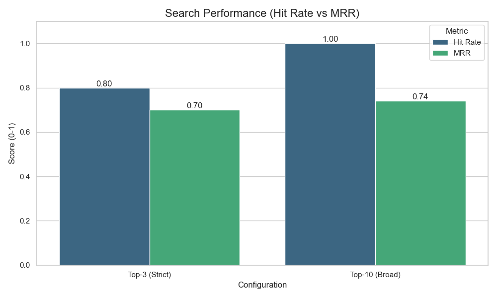
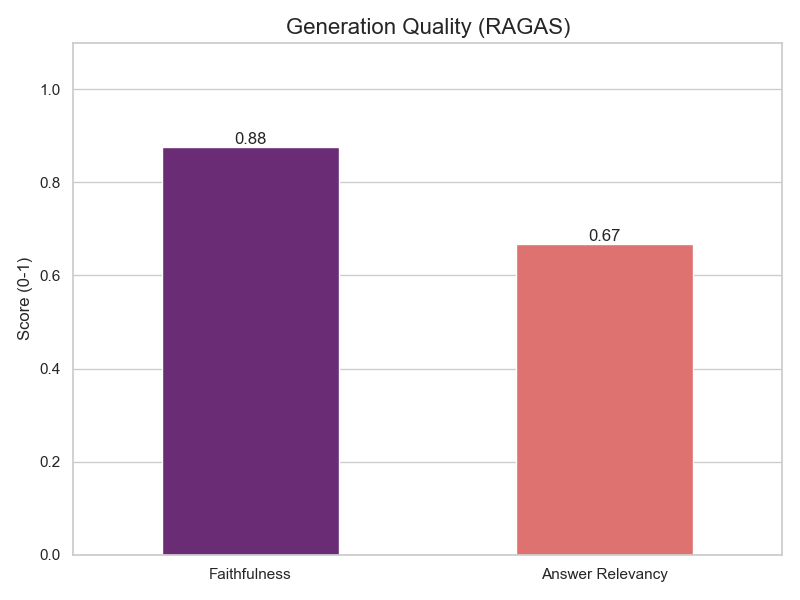

# RAG-BOE-ESPANA

RAG multimodal y local para experimentar con consultas sobre normativa espanola.
Combina recuperacion hibrida, reranking, vision y evaluacion reproducible sobre
documentos del Boletin Oficial del Estado.

[](https://github.com/AdrianGarciaCaballero/RAG-BOE-ESPANA/actions/workflows/ci.yml)
[](LICENSE)

> [!IMPORTANT]
> Es un proyecto de investigacion, no una fuente oficial ni asesoramiento legal.
> Verifica siempre la normativa en [boe.es](https://www.boe.es).

## Que incluye

- Extraccion de texto y tablas desde PDF con PyMuPDF y PyMuPDF4LLM.
- Recuperacion hibrida BM25 + embeddings con Reciprocal Rank Fusion.
- Reranking con un cross-encoder.
- Analisis de imagenes y consultas multimodales mediante Ollama.
- API FastAPI, interfaz Streamlit y bot opcional de Telegram.
- Evaluaciones de recuperacion y generacion con Hit Rate, MRR y RAGAS.
- Fixtures sinteticos de RR. HH. para demostrar routing de datos estructurados.

## Arquitectura

```text
src/
  api/          API, grafo de consulta y recuperacion
  frontend/     interfaz Streamlit
  ingestion/    ingesta de PDF, imagenes y CSV
  evaluation/   evaluaciones y graficos
  bot/          integracion opcional con Telegram
  utils/        herramientas de datos
data/           fixtures sinteticos y golden dataset
docs/           documentos juridicos de terceros
static/         metricas y artefactos publicos
tests/          pruebas unitarias ligeras
```

## Requisitos

- Python 3.11
- [Ollama](https://ollama.com/)
- Espacio local para modelos, ChromaDB y documentos

Los modelos configurados actualmente son:

```bash
ollama pull llama3.2
ollama pull llama3.2-vision
```

## Instalacion

```bash
git clone https://github.com/AdrianGarciaCaballero/RAG-BOE-ESPANA.git
cd RAG-BOE-ESPANA
python3.11 -m venv .venv
source .venv/bin/activate
python -m pip install --upgrade pip
python -m pip install -r requirements.txt
cp .env.example .env
```

Edita `.env` y sustituye `RAG_ADMIN_API_KEY` por un valor aleatorio largo. Por
ejemplo, puedes generar uno localmente con:

```bash
python -c "import secrets; print(secrets.token_urlsafe(32))"
```

No publiques `.env` ni compartas el token. `TELEGRAM_TOKEN` solo es necesario si
vas a ejecutar el bot.

## Ejecucion

### 1. Ingestar el corpus

```bash
python -m src.ingestion.ingest_multimodal
python -m src.ingestion.ingest_csv
```

La ingesta crea `chroma_db/` y `static/labeled_images/`, ambos ignorados por Git.

### 2. Iniciar la API

```bash
python -m src.api.main
```

La API escucha en `127.0.0.1:8000` por defecto. No la expongas a una red sin
aplicar las medidas de produccion descritas en [SECURITY.md](SECURITY.md).

### 3. Iniciar la interfaz

En otra terminal, con el mismo entorno y variables:

```bash
streamlit run src/frontend/frontend.py
```

La interfaz queda disponible normalmente en `http://localhost:8501`.

### 4. Bot de Telegram opcional

Configura `TELEGRAM_TOKEN` en `.env` y ejecuta:

```bash
python -m src.bot.telegram_bot
```

## API administrativa

La subida y eliminacion de documentos requieren el token configurado en
`RAG_ADMIN_API_KEY`:

```bash
curl -X POST http://127.0.0.1:8000/ingest \
  -H "Authorization: Bearer $RAG_ADMIN_API_KEY" \
  -F "file=@documento.pdf"
```

La API acepta unicamente nombres PDF simples, valida la cabecera del archivo y
limita cada subida a 25 MiB. En produccion siguen siendo necesarios un proxy con
TLS, autenticacion completa, limites en el borde, rate limiting y analisis de
malware.

## Evaluacion

### Recuperacion

```bash
python -m src.evaluation.eval_retrieval
```

Resultados publicados para la configuracion documentada en el repositorio:

| Configuracion | Hit Rate | MRR |
| --- | ---: | ---: |
| Top-3 | 0.80 | 0.70 |
| Top-10 | 1.00 | 0.74 |



### Generacion

```bash
python -m src.evaluation.eval_ragas
```

Resultados preliminares sobre una muestra de tres preguntas:

| Metrica | Resultado |
| --- | ---: |
| Faithfulness | 0.88 |
| Answer relevancy | 0.71 |



Estas cifras no son una garantia de precision juridica. Cada cambio de corpus,
modelo, chunking o prompt debe registrar su configuracion y volver a evaluarse.

## Datos y privacidad

Los CSV de `data/` son fixtures sinteticos. No representan expedientes laborales
reales y no deben usarse para tomar decisiones sobre personas. Nunca abras un
issue ni un pull request con datos personales, medicos, salariales o privados.

Los documentos bajo `docs/` proceden de la Agencia Estatal Boletin Oficial del
Estado y conservan sus propias condiciones. La licencia Apache-2.0 no los cubre.
Consulta [DATA_SOURCES.md](DATA_SOURCES.md) antes de reutilizarlos.

## Desarrollo

Las comprobaciones rapidas no descargan modelos ni levantan ChromaDB:

```bash
python -m compileall -q src tests
python -m unittest discover -s tests -v
```

La CI ejecuta ambos comandos en cada pull request. Para cambios de recuperacion o
generacion, incluye tambien las metricas relevantes en la descripcion del PR.

Consulta [CONTRIBUTING.md](CONTRIBUTING.md), [SECURITY.md](SECURITY.md),
[SUPPORT.md](SUPPORT.md), el [roadmap](ROADMAP.md), el
[changelog](CHANGELOG.md) y el [Code of Conduct](CODE_OF_CONDUCT.md).

## Mantenimiento

Adrian Garcia Caballero ([@AdrianGarciaCaballero](https://github.com/AdrianGarciaCaballero))
es el maintainer principal y propietario del repositorio. Issues y pull requests
son bienvenidos; las vulnerabilidades deben comunicarse de forma privada.

## Licencia

El codigo original y la documentacion del proyecto se publican bajo
[Apache License 2.0](LICENSE). Los documentos, datos, dependencias y modelos de
terceros conservan sus propias licencias y condiciones; consulta [NOTICE](NOTICE)
y [DATA_SOURCES.md](DATA_SOURCES.md).

## Procedencia de documentos

Cada documento de terceros en `docs/` esta registrado en
[`docs/provenance.yaml`](docs/provenance.yaml) con URL de origen, fecha de
obtencion, checksum SHA-256, fecha del documento y terminos de reutilizacion.
Antes de anadir o actualizar un documento, edita el manifiesto y ejecuta
`python scripts/validate_provenance.py` para verificar checksums y campos
obligatorios. Consulta [DATA_SOURCES.md](DATA_SOURCES.md) para mas contexto.
